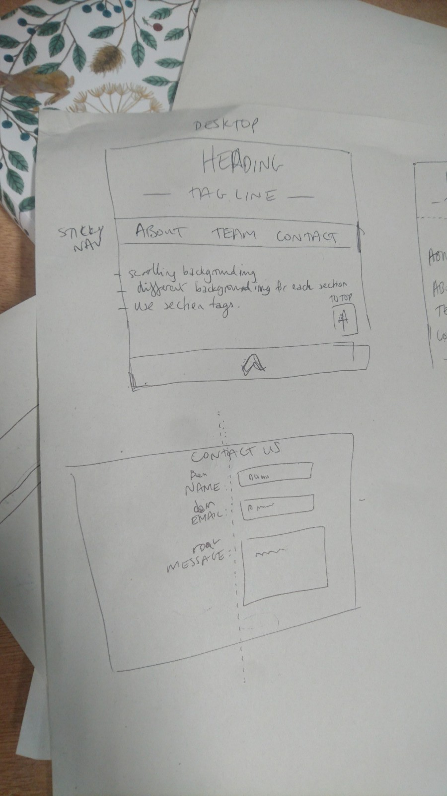

# screaming-bear-solutions 
Alex, Gillian, Kin, and Reggie's Epic :bear: Project (group AJNP)

# Hi from group AJNP!

## WHY
To practise working in a team, using pair programming and github workflow

## WHAT
We wanted a website that would clearly display the ethos of our growlingly great team, and meet the challenge objectives

## HOW (describing the journey to completion)
Our project has been designed from the beginning with our user stories in mind. 

We started by making issues for each of our user stories. We identified specific issues for each pair to work on at one time, e.g. create HTML, create CSS, work on Team section, create return to top functionality

We did some brainstorming as a group and made some notes on paper to help us visualise the layout of our site.

### Layout
We decided on a simple vertical structure of a heading at the top of our page, a sticky nav bar, each section, a footer, and a home bar which pops up at the bottom of the screen once you've scrolled down 200px

  

### Responsiveness
:iphone: mobile-first approach\
Media query for a 768px screen (tablet view) or bigger\
Therefore the desktop view follows the same layout as the tablet view

### Colour Scheme
We found a woodland colour scheme on Pinterest which matched our bear aesthetic 🌲.  Our main colour palette is:
* #000000 (black)
* #f0f1db (light cream/green)
* #465f3e (dark green)

### Fonts
Staatliches: headings and 'feature' text e.g. nav buttons\
Raleway: main content text

## WHAT WE'VE LEARNED
* git workflow: we learned how to resolve merge conflicts and the importance of making branches
* how to create github issues and implement them into the team workflow
* each team member has learned some new aspect of HTML and CSS from one another

## WHERE NEXT?
We are proud of our site but with more time we could add/fix some features, such as:
* increased screen reader functionality
* building out proper form behaviour
* improve use of BEM naming convention (we set out with the best intentions....)

