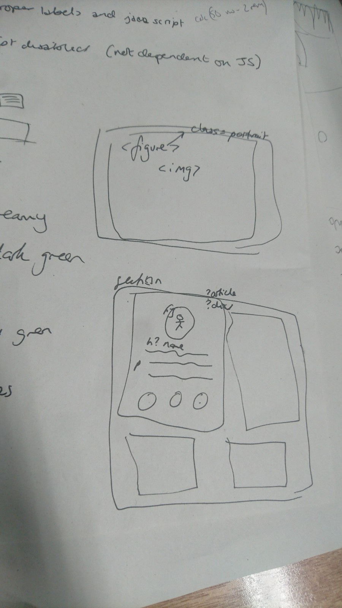

# screaming-bear-solutions 
Alex, Gillian, Kin, and Reggie's Epic :bear: Project (group AJNP)

## WHY
To practise working in a team, using pair programming and github workflow

## WHAT
We wanted a website that would clearly display the ethos of our growlingly great team, and meet the challenge objectives

## HOW (describing the journey to completion)
Our project has been designed from the beginning with our user stories in mind. 

We started by making issues for each of our user stories. We identified specific issues for each pair to work on at one time, e.g. create HTML, create CSS, work on Team section, create return to top functionality

We did some brainstorming as a group and made some notes on paper to help us visualise the layout of our site.

We decided to take a mobile-first approach to design, with a media query for a tablet view or bigger (i.e. the desktop view follows the same layout as the tablet view)

### Layout
We decided on a simple vertical structure of a heading at the top of our page, a sticky nav bar, each section, a footer, and a home bar which pops up at the bottom of the screen once you've scrolled down 200px

  

### Colour Scheme
We found a woodland colour scheme on Pinterest which matched our bear aesthetic 🌲.  Our main colour palette is:
* #000000 (black)
* #f0f1db (light cream/green)
* #465f3e (dark green)

## WHERE NEXT?
We are proud of our site but with more time we could add/fix some features, such as:
* increased screen reader functionality
